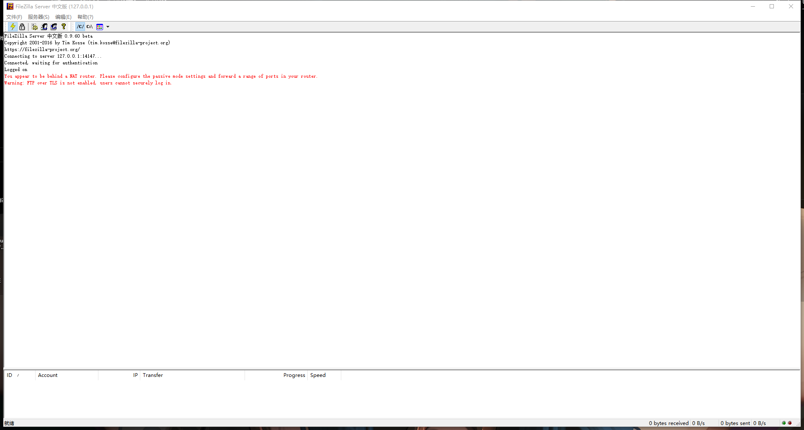

FTP是File Transfer Protocol(文件传输协议)，支持FTP协议的服务器就是FTP服务器。也可以理解为是在互联网上提供文件存储和访问服务的计算机。

## 创建一个FTP服务器

FTP服务器的搭建有各种各样的软件，且在不同的操作系统（windows，linux，mac）上都能进行部署，这里我是在Windows的操作系统上进行的部署，用到的软件是[FileZilla](https://www.filezilla.cn/)，是一款免费的Ftp服务器部署软件。可以点击链接去官网进行下载。

下载完成之后双击点击安装，基本上一路点击确定就行。
{: .shadow width="1548" height="864" style="max-width: 90%" }

